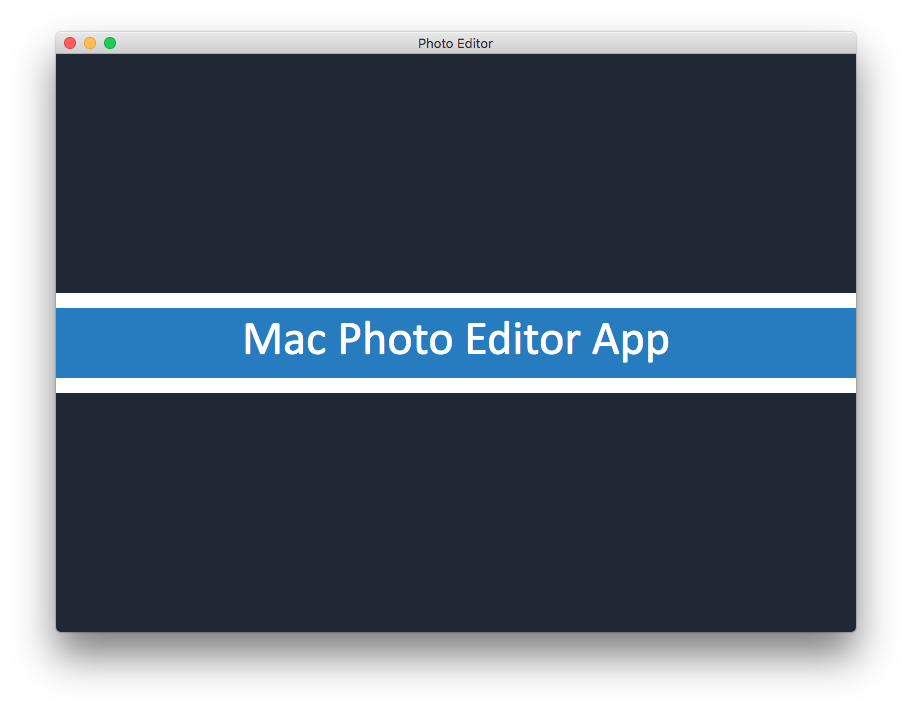

# Photo Editing App for Mac Desktop

### Run the app locally.
1.  `git clone https://github.com/HamiltonMultimedia/Photo-Editing-Desktop-App.git`
2. `npm install`
3. `npm start`

### Welcome Screen

